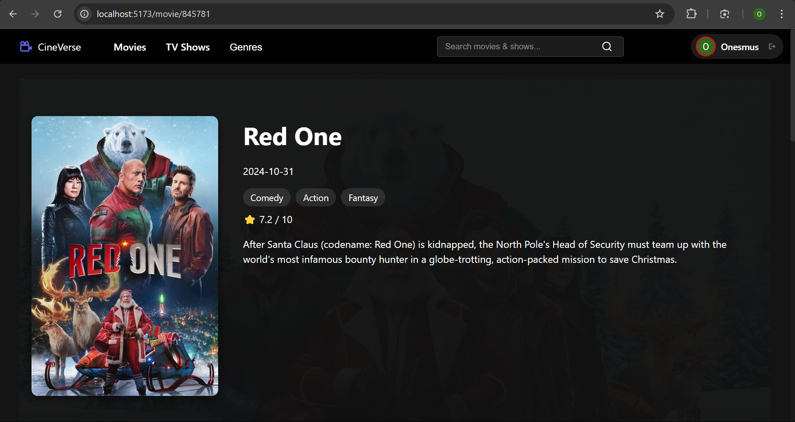
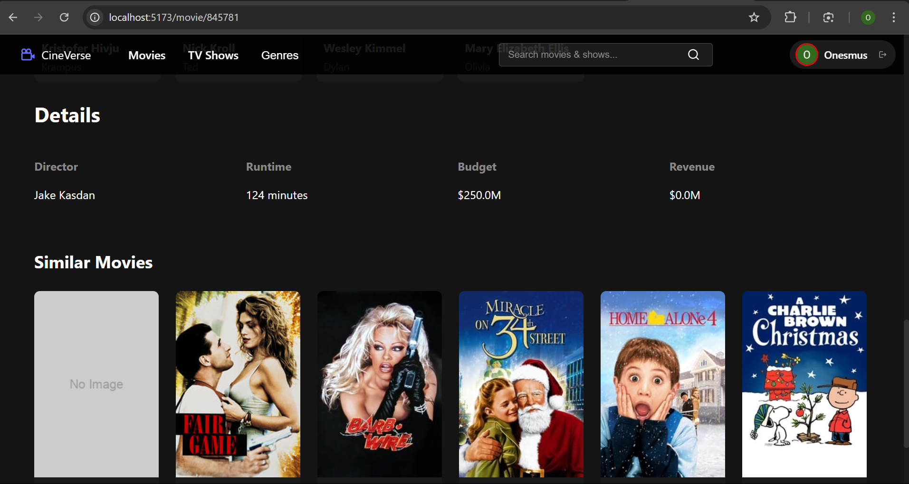
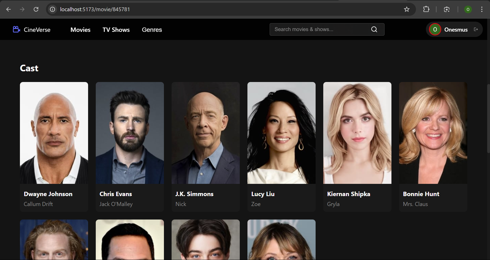

# CineVerse 🎬

CineVerse is a modern, responsive web application that serves as your gateway to exploring movies and TV shows. Built with React and powered by TMDB API, it offers a sleek interface for discovering, searching, and learning about your favorite entertainment content.



## 🌟 Features

- **Browse Movies & TV Shows**: Explore popular movies and TV series
- **Detailed Information**: Get comprehensive details about movies and shows including:
  - Cast and crew information
  - Ratings and release dates
  - Plot summaries
  - Similar content recommendations
- **Genre Exploration**: Browse content by specific genres
- **Search Functionality**: Find specific movies and TV shows
- **Responsive Design**: Seamless experience across all devices
- **Dark Theme**: Easy on the eyes with a modern dark interface

## 📱 Screenshots

### Movie Details Page


### Genre and Search Results


## 🛠️ Technologies Used

- React 18
- Vite
- React Router v6
- React Icons
- TMDB API
- CSS3

## ⚙️ Installation & Setup

1. Clone the repository
```bash
git clone https://github.com/onesmuskipchumba0/Cineverse.git
```

2. Navigate to the project directory
```bash
cd Cineverse
```

3. Install dependencies
```bash
npm install
```

4. Create a `.env` file in the root directory and add your TMDB API key
```bash
VITE_TMDB_API_KEY=your_api_key_here
```

5. Start the development server
```bash
npm run dev
```

## 🔑 API Configuration

This project uses The Movie Database (TMDB) API. To run the project:

1. Sign up for an account at [TMDB](https://www.themoviedb.org/)
2. Get your API key from your account settings
3. Add the API key to your `.env` file as shown above

## 🎯 Core Functionality

- **Navigation Bar**: Quick access to movies, TV shows, and genres
- **Movie/Show Cards**: Clickable cards with basic information
- **Detailed Views**: Comprehensive information about selected content
- **Similar Content**: Recommendations based on current selection
- **Genre Filtering**: Content categorization by genres
- **Search**: Global search functionality for all content

## 🔄 API Integration

The application integrates with the following TMDB endpoints:
- Popular Movies
- Popular TV Shows
- Movie/Show Details
- Cast Information
- Similar Content
- Genre Lists
- Search

## 📱 Responsive Design

CineVerse is fully responsive and optimized for:
- Desktop computers
- Tablets
- Mobile phones

## 🛠️ Development

To contribute to this project:

1. Fork the repository
2. Create your feature branch
```bash
git checkout -b feature/AmazingFeature
```
3. Commit your changes
```bash
git commit -m 'Add some AmazingFeature'
```
4. Push to the branch
```bash
git push origin feature/AmazingFeature
```
5. Open a Pull Request

## 📝 Future Enhancements

- User authentication
- Watchlist functionality
- User ratings and reviews
- Advanced filtering options
- Trailer integration
- Personalized recommendations

## 👥 Contributing

Contributions are welcome! Feel free to submit issues and pull requests.

## 📄 License

This project is licensed under the MIT License - see the [LICENSE](LICENSE) file for details.

## 🙏 Acknowledgments

- [TMDB](https://www.themoviedb.org/) for their comprehensive API
- [React Icons](https://react-icons.github.io/react-icons/) for the icon set
- All contributors and users of the application

## 📧 Contact

Onesmus kipChumba - [@onesmuskipchumba0](https://github.com/onesmuskipchumba0)

Project Link: [https://github.com/onesmuskipchumba0/Cineverse](https://github.com/onesmuskipchumba0/Cineverse)

